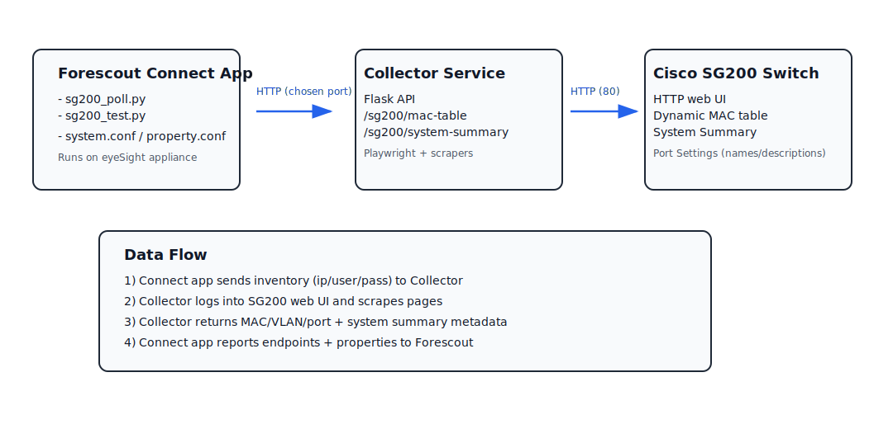
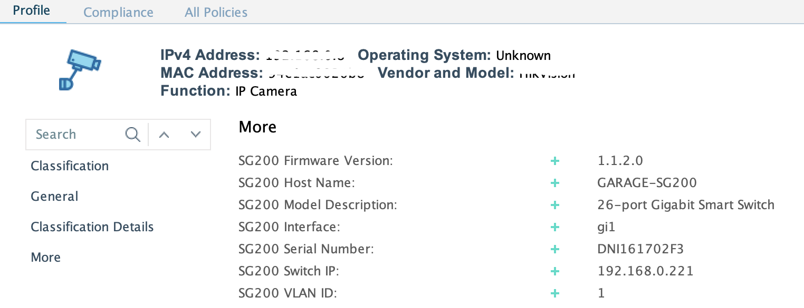

# SG200 Collector + Forescout Connect App

This repository contains:

- **Playwright-based collector** for Cisco SG200 switches.
- **Forescout Connect app package** for SG200 that calls the external collector.
- Packaged zip artifacts for each app version.





This project provides an HTTP collector service and a Forescout Connect app that calls the collector to inventory Cisco SG200 switches, in order to enrich endpoint records in the Forescout eyeSight console.

**Important: This is an “as-is” community effort. It is not supported by Forescout, has not been reviewed or signed by Forescout, and is provided for use at your own discretion. You are responsible for validating security, operational impact, and compatibility in your environment before deploying to production.**

Primary outcomes in eyeSight:
- Switch attribution for endpoints (which switch observed the MAC).
- Network attachment context (VLAN and switch interface name) mapped into device properties for policy, tagging, and response workflows.


## Key capabilities (value in Forescout eyeSight)

- Enriches eyeSight endpoint records with switch-derived context for device identification and response workflows.
- Publishes the following as device properties in the eyeSight console:
  - Switch identity (hostname, serial number, model, firmware)
  - Network attachment context from the SG200 MAC table:
    - VLAN
    - Switch interface name (e.g., GE1, GE2, …)
- Enables Connect-based policies, tags, and automation actions that depend on “where the device is connected” (interface/VLAN) and “what infrastructure reported it” (switch identity).
  




## Components

- Collector App: `collector.py` (Flask app) and SG200 scraper: `scrapers/sg200_client.py` (Playwright-based), downloadable as a **collector.zip** file
- Collectore App: Windows installer for production deployment (runs as a service)
- Cisco SG200 Connect app for Forescout eyeSight, downloadable as a **CiscoSG200ConnectApp.zip** file
  

---

## System requirements

Windows:
- Windows 10/11 or Windows Server 2019+
- Python 3.10+
- Network reachability from the collector host to the SG200 management UI

---

# Deployment (Windows)

This deployment flow is ordered as follows:
1) Deploy and run the collector.
2) Test the collector against your SG200 using CLI.
3) Only after successful CLI validation, install/configure the Forescout Connect app.

## Step 1 — Deploy the collector

### 1.1 Extract files

Create directories:
- `C:\SG200Collector\current\`
- `C:\SG200Collector\logs\`

Extract the collector release zip into `C:\SG200Collector\current\` and confirm:
- `collector.py`
- `scrapers\` directory

### 1.2 Create virtual environment and install dependencies

On Windows (PowerShell):

```powershell
cd C:\SG200Collector\current
py -m venv venv
.\venv\Scripts\activate
(it may be necessary to "Set-ExecutionPolicy Bypass -Scope Process -Force")
python -m pip install --upgrade pip
pip install flask waitress playwright requests beautifulsoup4
python -m playwright install chromium
```

### 1.3 Configure request controls (optional)

Edit `C:\SG200Collector\current\collector_security.json` if additional security controls are desired:

```json
## edit the details below, then delete this line to activate security features, then restart collector.py ##

{
  "allowed_ips": ["192.168.0.45", "192.168.1.201", "192.168.1.200"],
  "token": "test-token"
}

```

Operational guidance:
- The `allowed_ips` list should include the eyeSight appliance(s) that will run the Connect app polling.
  - In Forescout, these are the appliance(s) selected in the app configuration panel typically labeled “Assign eyeSight Devices”.
- While validating from an admin workstation, add that workstation’s IP temporarily, or run the CLI tests locally on the collector host using `127.0.0.1`.

### 1.4 Run the collector interactively (initial validation)

**WIN Firewall Advisory**

When you start the collector in an interactive user session (terminal) and bind to 0.0.0.0:8081, Windows Defender Firewall may display the “Windows Defender Firewall has blocked some features of this app” prompt the first time it detects inbound listening/traffic for that executable (often python.exe).
Do not rely on a Windows prompt to open the port. Create an explicit inbound rule for TCP 8081.

Start the collector on localhost:

Example (PowerShell):
```powershell
New-NetFirewallRule -DisplayName "SG200 Collector (TCP 8081)" -Direction Inbound -Action Allow -Protocol TCP -LocalPort 8081
```

Windows (PowerShell):
```powershell
cd C:\SG200Collector\current
.\venv\Scripts\activate
waitress-serve --host=127.0.0.1 --port=8081 collector:app
```

Verify the collector is reachable (run in a second terminal on the same host):

Windows (PowerShell):
```powershell
curl.exe -fsS "http://127.0.0.1:8081/health"
```


Keep the collector running for Step 2.

---

## Step 2 — Validate switch communication via CLI

This step proves the collector can authenticate to the SG200 and scrape the required pages. Do not proceed to Forescout until these calls succeed.

POST body fields:
- `ip`: SG200 switch management IP address (the same IP you use in the browser to manage the switch)
- `user`: SG200 web UI username
- `pass`: SG200 web UI password

Authentication header:
- `X-Collector-Token`: must match the `token` value configured in `collector_security.json`

### 2.1 Test system identity - examples
Provide switch IP and creds as prompted
**Windows** (PowerShell) without auth:

```
$uri='http://127.0.0.1:8081/sg200/system-summary'; $payload=@{ip=(Read-Host 'IP');user=(Read-Host 'User');pass=(&{$s=Read-Host 'Pass' -AsSecureString;$p=[Runtime.InteropServices.Marshal]::SecureStringToBSTR($s);try{[Runtime.InteropServices.Marshal]::PtrToStringBSTR($p)}finally{[Runtime.InteropServices.Marshal]::ZeroFreeBSTR($p)}})}|ConvertTo-Json -Compress; Invoke-RestMethod -Method Post -Uri $uri -ContentType 'application/json' -Body $payload
```

**Windows** (PowerShell) with auth:
```powershell
$uri='http://127.0.0.1:8081/sg200/system-summary';$ip=Read-Host 'IP';$user=Read-Host 'User';$passS=Read-Host 'Pass' -AsSecureString;$tokS=Read-Host 'Token' -AsSecureString;$pPtr=[Runtime.InteropServices.Marshal]::SecureStringToBSTR($passS);$pass=[Runtime.InteropServices.Marshal]::PtrToStringBSTR($pPtr);[Runtime.InteropServices.Marshal]::ZeroFreeBSTR($pPtr);$tPtr=[Runtime.InteropServices.Marshal]::SecureStringToBSTR($tokS);$token=[Runtime.InteropServices.Marshal]::PtrToStringBSTR($tPtr);[Runtime.InteropServices.Marshal]::ZeroFreeBSTR($tPtr);$body=@{ip=$ip;user=$user;pass=$pass}|ConvertTo-Json -Compress;$headers=@{'X-Collector-Token'=$token};$r=Invoke-RestMethod -Method Post -Uri $uri -ContentType 'application/json' -Headers $headers -Body $body; $r.PSObject.Properties | ForEach-Object {[pscustomobject]@{field=$_.Name;value=$_.Value}} | Format-Table -AutoSize field,value
````
expected response looks like:

| field | value |
|---|---|
| firmware_version | 1.1.2.0 |
| host_name | GARAGE-SG200 |
| model_description | 26-port Gigabit Smart Switch |
| serial_number | DNI161702F3 |
| switch_ip | 192.168.1.221 |


### 2.2 Test MAC table and interface name mapping - examples

**Windows** (PowerShell) without auth:

```
 $uri='http://127.0.0.1:8081/sg200/mac-table'; $payload=@{ip=(Read-Host 'IP');user=(Read-Host 'User');pass=(&{$s=Read-Host 'Pass' -AsSecureString;$p=[Runtime.InteropServices.Marshal]::SecureStringToBSTR($s);try{[Runtime.InteropServices.Marshal]::PtrToStringBSTR($p)}finally{[Runtime.InteropServices.Marshal]::ZeroFreeBSTR($p)}})}|ConvertTo-Json -Compress; (Invoke-RestMethod -Method Post -Uri $uri -ContentType 'application/json' -Body $payload).entries | Select-Object mac,port_index,vlan,switch_ip | Format-Table -AutoSize
```

**Windows** (PowerShell) with auth:

```powershell
$uri='http://127.0.0.1:8081/sg200/mac-table';$ip=Read-Host 'IP';$user=Read-Host 'User';$passS=Read-Host 'Pass' -AsSecureString;$tokS=Read-Host 'Token' -AsSecureString;$pPtr=[Runtime.InteropServices.Marshal]::SecureStringToBSTR($passS);$pass=[Runtime.InteropServices.Marshal]::PtrToStringBSTR($pPtr);[Runtime.InteropServices.Marshal]::ZeroFreeBSTR($pPtr);$tPtr=[Runtime.InteropServices.Marshal]::SecureStringToBSTR($tokS);$token=[Runtime.InteropServices.Marshal]::PtrToStringBSTR($tPtr);[Runtime.InteropServices.Marshal]::ZeroFreeBSTR($tPtr);$body=@{ip=$ip;user=$user;pass=$pass}|ConvertTo-Json -Compress;$headers=@{'X-Collector-Token'=$token};(Invoke-RestMethod -Method Post -Uri $uri -ContentType 'application/json' -Headers $headers -Body $body).entries | Select-Object mac,port_index,vlan,switch_ip | Format-Table -AutoSize
```
expected response looks like:


| mac | port_index | vlan | switch_ip |
|---|---|---|---|
| 00:0c:29:8d:2f:64 | gi25 | 1 | 192.168.1.221 |
| 00:0c:29:b2:94:c0 | gi25 | 1 | 192.168.1.221 |
| 00:0c:29:bf:9c:73 | gi25 | 1 | 192.168.1.221 |
| 00:0c:29:e3:95:a7 | gi4 | 1 | 192.168.1.221 |
| 00:50:56:6c:d9:ff | gi4 | 1 | 192.168.1.221 |
| 00:50:56:a5:09:e0 | gi4 | 1 | 192.168.1.221 |


If either endpoint fails:

* Review the collector console output.
* Confirm SG200 IP/credentials.
* Confirm the collector host can reach the SG200 management UI.

---

## Step 3 — Production Deployment with Windows Installer (skip in test environments)

Download the SG200CollectorSetup.exe and run it as Administrator to install the collector, python, and Chromium components.
To enable allowlist ot token auth, copy 
**C:\Program Files\SG200Collector\config\collector_security.json** to **C:\Program Files\SG200Collector\app** 
edit it then restart collector services with **sc.exe stop SG200Collector** / **sc.exe start SG200Collector**
Refer to **Step 2** for testing.

---

## Step 4 — Install and configure the Forescout Connect app

Only proceed after **Step 2** succeeds.

### 4.1 Allow unsigned Connect apps (Enterprise Manager)

This app is unofficial/unsigned. On the Enterprise Manager, enable unsigned app import:

```text
fstool allow_unsigned_connect_app_install true
```

After importing the app, you can revert enforcement:

```text
fstool allow_unsigned_connect_app_install false
```

### 4.2 Import and configure the app

High-level:
1. Import the Connect app package in the Forescout Console.
2. Configure:
   - Collector Host and Port (Windows collector host and 8081)
   - Collector Token (must match `collector_security.json`)
   - Switch definitions: up to 16 switches can be configured in the app
3. In “Assign eyeSight Devices”, select the appliance(s) that will run the app.
4. Enable discovery options and set the interval:
   - Recommended polling interval: 10 minutes or longer (to reduce scraping load and avoid overlapping sessions).
5. Run a manual Refresh/Test once and confirm properties populate in eyeSight.

---

## Monitoring in Production

Tail logs:
```powershell
Get-Content "C:\Program Files\SG200Collector\logs\SG200Collector.err.log" -Tail 50 -Wait
```

